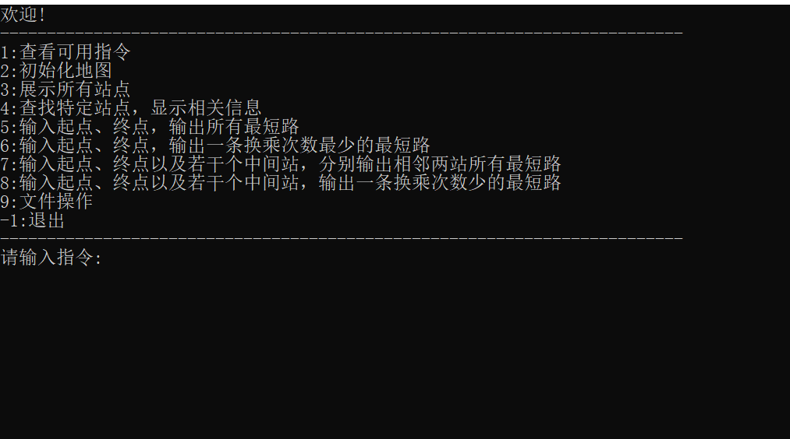

# Project 2	Navigation

## 一、简易说明

Project2分为两个***C++***源文件：`bellman_ford.cpp`和`dijkstra.cpp`，实现了利用两个不同算法进行地铁最短路的计算。

- 二者除了最短路核心实现函数不同外，其余代码基本一致，实现的功能有地图的初始化、地图站点的展示、地图站点的查找、给定起终点（以及中间站）的所有最短路的绘制、给定起终点（以及中间站）的单个小换乘数最短路的绘制、对文件的操作等。
- 在给定中间站绘制所有最短路时，为避免输出的路线过多，选择输出每一段的最短路线。
- 对地图的初始化为了数据读取的方便，根据`Timetable.xlsx`制作了相应`data.txt`，进行地图初始化。
- 所有数据文件中将4号线的浦电路站记为”浦电路4“，6号线的浦电路站记为“浦电路6”，进行区分；将“富 锦 路”更改为“富锦路”。
- 两个源代码文件均采用GBK编码；利用g++编译器进行编译，生成了exe可执行程序。


## 二、使用说明

两个程序的进入界面均如下图所示，输入相应指令代码可以进行相应操作。




## 三、设计细节

### （一）函数组成及设计

源代码的所有函数声明以及`main`函数实现如下：

```c++
//下面为bellman_ford.cpp的相应部分
void system();
void print_direct();
void init_map();
void show_map();
void search_map();
void print_all();
void print_one();
void file_process();

void bellman_ford(int s);	//dijkstra.cpp将此行更改为 void dijkstra(int s); 
void store_path(int s, int v);
void print_path(const vector<int> &a);
int change_cal(const vector<int> &a);
void print_together_(const vector<int> &a, ostream &out);

int main() {
    system();

    return 0;
}
```

其中，`system`函数为主体函数，第3~9行的函数为各个功能函数。由于在绘制路径的函数中，站点个数对于函数的代码实现无影响，所以虽然指令选择界面将包含中间站单独分开，但函数实现是同一个。函数`print_all`的功能为绘制相邻两站的所有最短路，其实现主要步骤为`bellman_ford`（`dijkstra`） $${\longrightarrow}$$ `store_path` $${\longrightarrow}$$ `print_path`；函数`print_one`的功能为绘制一条换乘次数小的最短路，其主要实现步骤为`bellman_ford`（`dijkstra`） $${\longrightarrow}$$ `store_path` $${\longrightarrow}$$ `change_cal` $${\longrightarrow}$$ `print_together_` ；函数`file_process`的功能是读取文件，并将结果输出到文件，由于其输出格式与函数`print_one`一致，故其与函数`print_one`步骤基本一致。

程序具有较强的鲁棒性，非指定输入会输出错误提醒，程序不会异常退出。例如，运行程序后不进行地图初始化直接进行其他操作，程序都不会崩溃退出。

程序中的对象命名本着易懂的原则，在命名上体现出该对象的特征与功能，便于阅读。


### （二）最短路算法部分分析

最短路算法部分是两个源文件最大的不同之处。

#### 1.bellman_ford

`bellman_ford.cpp`中的函数`bellman_ford`代码实现如下：

```c++
void bellman_ford(int s) {
    memset(dis, 63, sizeof(dis));
    memset(vis, 0, sizeof(vis));
    _rep(i, 0, STA_MAX - 1) prevs[i].clear();
    prevs[s].push_back({s, adj[s].front().line, 0});
    dis[s] = 0, vis[s] = 1, q.push(s);
    while (!q.empty()) {
		int u = q.front();
		q.pop();
		vis[u] = 0;
		for (auto e : adj[u]) {
			int v = e.end;
			int w = e.length;
            if (dis[v] >= dis[u] + w) { 
                if (dis[v] > dis[u] + w) {
                    dis[v] = dis[u] + w;
                    road_length[s][v] = dis[v];
                    if (!vis[v]) vis[v] = 1, q.push(v);
                    prevs[v].clear();
			    }
                Edge _e = {u, e.line, e.length}; 
                vector<Edge>::iterator it = find(prevs[v].begin(), prevs[v].end(), _e);
                if (it == prevs[v].end()) prevs[v].push_back(_e);  
            }
		}
    }  
}
```

首先，由于在bellman_ford算法中，只有上一次被松弛的结点，所连接的边，才有可能引起下一次的松弛操作，所以采用队列维护可以引起松弛操作的点，对基础算法进行优化，减少无用的松弛操作（即SPFA）。

另外，与单纯的求最短路数值的算法不同，在本工程中需要将两点间所有的最短路进行保存，故每个点都存在一个记录前驱的vector容器，对代码的改变首先体现在第14行的操作判定条件，为找出所有最短路，将“>”改为“>=”，满足条件时将新的不重复的前驱加入到相应的`prevs`中；其次，在`dis`更新变小时，清空相应的`prevs`。利用函数`store_path`记录完整路径。

#### 2.dijkstra

`dijkstra.cpp`中的函数`dijkstra`代码实现如下：

```c++
void dijkstra(int s) {
    memset(dis, 63, sizeof(dis));
    memset(vis, 0, sizeof(vis));
    _rep(i, 0, STA_MAX - 1) prevs[i].clear();
    dis[s] = 0;
    prevs[s].push_back({s, adj[s].front().line, 0});
    q.push({s, 0});
    while (!q.empty()) {
		int u = q.top().vertex;
		q.pop();
		if (vis[u]) continue;
		vis[u] = 1;
		for (auto e : adj[u]) {
			int v = e.end;
			int w = e.length;
			if (dis[v] >= dis[u] + w) {
                if (dis[v] > dis[u] + w) {
                    dis[v] = dis[u] + w;
                    road_length[s][v] = dis[v];
                    q.push({v, dis[v]});
                    prevs[v].clear();
                }
                prevs[v].push_back({u, e.line, e.length});
			}
		}
    }  
}
```

首先，在dijkstra算法中，每轮操作都要选取一个最短路长度最小的结点，移到**S**集合中，此工程中的函数采用了优先队列来维护所要求的结点，从而降低时间复杂度。

另外，与单纯的求最短路数值的算法不同，在本工程中需要将两点间所有的最短路进行保存，故每个点都存在一个记录前驱的vector容器`prevs`，对代码的改变首先体现在第16行的操作判定条件，为找出所有最短路，将“>”改为“>=”，满足条件时将新的前驱加入到相应的`prevs`中（`vis`保证了不会出现重复的前驱）；其次，在`dis`更新变小时，清空相应的`prevs`。利用函数`store_path`记录完整路径。


## 四、感悟想法

和上次Project类似，要求实现的功能由两种算法分别完成。在本次Project中，`bellman_ford.cpp`和`dijkstra.cpp`重合率很高，借助面向对象的思想，可以将两种实现写在一个工程中，通过继承的方式完成两种不同的算法，使二者更为统一（在本工程中，为了便于展示，采取了将两种算法分开的写法）。

bellman_ford算法通过队列的方式进行维护，可以避免了普通实现中每轮多余的松弛操作，从而可以在大多数情况下有效地降低算法的时间复杂度。

我认为工程中最重要的是对两个站点之间所有最短路的储存，而两种算法都是用来更新求解最短路长度，这就需要在原始算法的基础上加以改造，既然不单单只需要数值，那就不能只在距离变小时进行操作，在搜索到相同距离的其他路径时也应当对前驱进行储存；其次，在距离更新变小过程中，相应地进行前驱的清空操作。这就是对于算法改造的大体思路。

